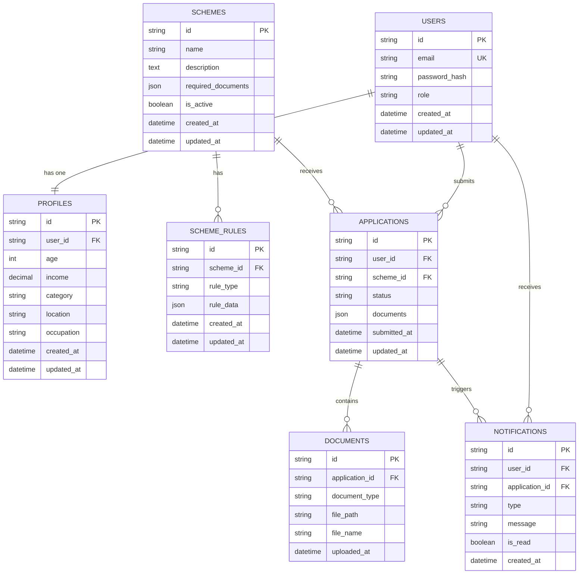

# ER Diagram - YojnaSetu Database Schema

## Entity Descriptions

### USERS Table
Stores user account information for both citizens and admins.

**Fields:**
- `id` (Primary Key): Unique identifier for each user
- `email` (Unique): User's email address (used for login)
- `password_hash`: Hashed password using bcrypt/argon2
- `role`: User role ('citizen' or 'admin')
- `created_at`: Account creation timestamp
- `updated_at`: Last update timestamp

**Indexes:**
- Primary key on `id`
- Unique index on `email`
- Index on `role` for role-based queries

### PROFILES Table
Stores citizen profile information used for eligibility evaluation.

**Fields:**
- `id` (Primary Key): Unique identifier for each profile
- `user_id` (Foreign Key → USERS.id): Reference to the user
- `age`: User's age in years
- `income`: Annual income in currency units
- `category`: Social category (SC/ST/OBC/General)
- `location`: User's location/state
- `occupation`: User's occupation
- `created_at`: Profile creation timestamp
- `updated_at`: Last update timestamp

**Constraints:**
- One-to-one relationship with USERS
- `age` must be positive integer
- `income` must be non-negative
- `category` must be from allowed values

### SCHEMES Table
Stores government scheme information.

**Fields:**
- `id` (Primary Key): Unique identifier for each scheme
- `name`: Scheme name
- `description`: Detailed description of the scheme
- `required_documents`: JSON array of required document types
- `is_active`: Boolean flag to show/hide scheme
- `created_at`: Scheme creation timestamp
- `updated_at`: Last update timestamp

**Indexes:**
- Primary key on `id`
- Index on `is_active` for filtering active schemes

### SCHEME_RULES Table
Stores eligibility rules for each scheme. Supports multiple rules per scheme.

**Fields:**
- `id` (Primary Key): Unique identifier for each rule
- `scheme_id` (Foreign Key → SCHEMES.id): Reference to the scheme
- `rule_type`: Type of rule (AGE, INCOME, CATEGORY, LOCATION, OCCUPATION)
- `rule_data`: JSON object containing rule-specific parameters
  - Example for AGE: `{"minAge": 18, "maxAge": 60}`
  - Example for INCOME: `{"maxIncome": 500000}`
  - Example for CATEGORY: `{"allowedCategories": ["SC", "ST", "OBC"]}`
- `created_at`: Rule creation timestamp
- `updated_at`: Last update timestamp

**Constraints:**
- Many-to-one relationship with SCHEMES
- `rule_type` must be from allowed values
- `rule_data` must be valid JSON

### APPLICATIONS Table
Stores citizen applications for schemes.

**Fields:**
- `id` (Primary Key): Unique identifier for each application
- `user_id` (Foreign Key → USERS.id): Reference to the applicant
- `scheme_id` (Foreign Key → SCHEMES.id): Reference to the scheme
- `status`: Application status (PENDING, APPROVED, REJECTED, UNDER_REVIEW)
- `documents`: JSON array of uploaded document references
- `submitted_at`: Application submission timestamp
- `updated_at`: Last status update timestamp

**Constraints:**
- Many-to-one relationship with USERS
- Many-to-one relationship with SCHEMES
- `status` must be from allowed values
- Unique constraint on (user_id, scheme_id) to prevent duplicate applications

**Indexes:**
- Index on `user_id` for user's application history
- Index on `scheme_id` for scheme-wise applications
- Index on `status` for filtering by status

### DOCUMENTS Table
Stores uploaded document metadata for applications.

**Fields:**
- `id` (Primary Key): Unique identifier for each document
- `application_id` (Foreign Key → APPLICATIONS.id): Reference to the application
- `document_type`: Type of document (AADHAR, INCOME_CERTIFICATE, etc.)
- `file_path`: Storage path of the document file
- `file_name`: Original filename
- `uploaded_at`: Upload timestamp

**Constraints:**
- Many-to-one relationship with APPLICATIONS

### NOTIFICATIONS Table
Stores notifications for users about application updates.

**Fields:**
- `id` (Primary Key): Unique identifier for each notification
- `user_id` (Foreign Key → USERS.id): Reference to the user
- `application_id` (Foreign Key → APPLICATIONS.id): Reference to the application (nullable)
- `type`: Notification type (APPLICATION_SUBMITTED, STATUS_UPDATED, etc.)
- `message`: Notification message text
- `is_read`: Boolean flag indicating if notification is read
- `created_at`: Notification creation timestamp

**Constraints:**
- Many-to-one relationship with USERS
- Optional relationship with APPLICATIONS

**Indexes:**
- Index on `user_id` for user notifications
- Index on `is_read` for unread notifications

## Relationship Summary

1. **USERS → PROFILES**: One-to-one (each user has one profile)
2. **USERS → APPLICATIONS**: One-to-many (each user can submit multiple applications)
3. **USERS → NOTIFICATIONS**: One-to-many (each user receives multiple notifications)
4. **SCHEMES → SCHEME_RULES**: One-to-many (each scheme has multiple rules)
5. **SCHEMES → APPLICATIONS**: One-to-many (each scheme receives multiple applications)
6. **APPLICATIONS → DOCUMENTS**: One-to-many (each application has multiple documents)
7. **APPLICATIONS → NOTIFICATIONS**: One-to-many (each application can trigger multiple notifications)

## Additional Database Considerations

### Indexes
- Composite index on `(user_id, scheme_id)` in APPLICATIONS for quick eligibility checks
- Full-text index on SCHEMES.name and SCHEMES.description for search functionality
- Index on PROFILES.category, location for filtering

### Constraints
- Check constraint on PROFILES.age: `age >= 0 AND age <= 150`
- Check constraint on PROFILES.income: `income >= 0`
- Check constraint on APPLICATIONS.status: `status IN ('PENDING', 'APPROVED', 'REJECTED', 'UNDER_REVIEW')`
- Foreign key constraints with CASCADE DELETE where appropriate

### Triggers (Optional)
- Auto-update `updated_at` timestamp on row updates
- Auto-create notification when application status changes
- Validate rule_data JSON structure on insert/update
