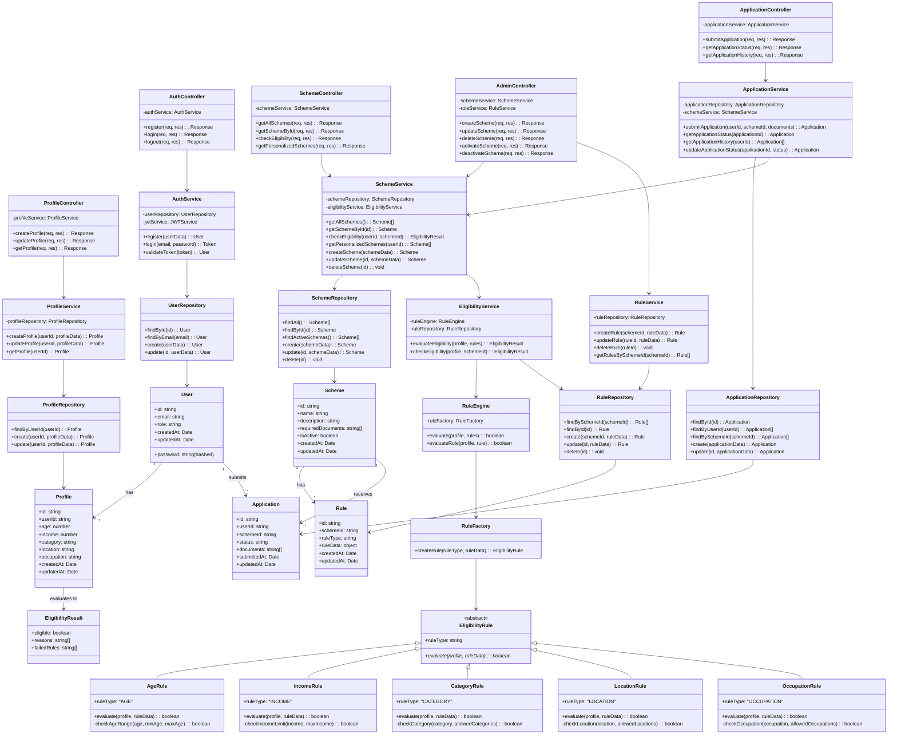

# Class Diagram - YojnaSetu

## Class Descriptions

### Controllers
- **AuthController**: Handles user authentication (register, login, logout)
- **ProfileController**: Manages user profile operations
- **SchemeController**: Handles scheme browsing and eligibility checking for citizens
- **AdminController**: Manages scheme and rule CRUD operations for admins
- **ApplicationController**: Handles application submission and tracking

### Services
- **AuthService**: Business logic for authentication and authorization
- **ProfileService**: Profile management logic
- **SchemeService**: Scheme-related business logic and eligibility orchestration
- **EligibilityService**: Coordinates eligibility evaluation
- **RuleService**: Rule management operations
- **ApplicationService**: Application lifecycle management

### Rule Engine
- **RuleEngine**: Main orchestrator for rule evaluation
- **RuleFactory**: Creates appropriate rule instances based on type
- **EligibilityRule**: Abstract base class for all rule types
- **Concrete Rules**: AgeRule, IncomeRule, CategoryRule, LocationRule, OccupationRule

### Repositories
- Data access layer for each entity (User, Profile, Scheme, Rule, Application)

### Models
- **User**: User account information
- **Profile**: Citizen profile data
- **Scheme**: Government scheme information
- **Rule**: Eligibility rule definition
- **Application**: Scheme application record
- **EligibilityResult**: Result of eligibility evaluation
