# Sequence Diagram - YojnaSetu Main Flow

## 1. User Registration & Profile Creation Flow

## 2. Scheme Eligibility Check Flow

```mermaid
sequenceDiagram
    participant User as 👤 Citizen
    participant UI as Frontend
    participant SchemeController as Scheme Controller
    participant SchemeService as Scheme Service
    participant EligibilityService as Eligibility Service
    participant RuleEngine as Rule Engine
    participant AgeRule as AgeRule
    participant IncomeRule as IncomeRule
    participant CategoryRule as CategoryRule
    participant ProfileRepo as Profile Repository
    participant SchemeRepo as Scheme Repository
    participant RuleRepo as Rule Repository
    participant DB as Database

    User->>UI: Click "Check Eligibility" for Scheme X
    UI->>SchemeController: GET /api/schemes/:id/eligibility
    SchemeController->>SchemeService: checkEligibility(userId, schemeId)
    
    SchemeService->>ProfileRepo: findByUserId(userId)
    ProfileRepo->>DB: SELECT * FROM profiles WHERE user_id = ?
    DB-->>ProfileRepo: User profile
    ProfileRepo-->>SchemeService: Profile object
    
    SchemeService->>SchemeRepo: findById(schemeId)
    SchemeRepo->>DB: SELECT * FROM schemes WHERE id = ?
    DB-->>SchemeRepo: Scheme data
    SchemeRepo-->>SchemeService: Scheme object
    
    SchemeService->>RuleRepo: findBySchemeId(schemeId)
    RuleRepo->>DB: SELECT * FROM scheme_rules WHERE scheme_id = ?
    DB-->>RuleRepo: Rules array
    RuleRepo-->>SchemeService: Rules array
    
    SchemeService->>EligibilityService: evaluateEligibility(profile, rules)
    EligibilityService->>RuleEngine: evaluate(profile, rules)
    
    loop For each rule
        RuleEngine->>RuleEngine: getRuleType(rule)
        
        alt Rule type is AGE
            RuleEngine->>AgeRule: evaluate(profile, rule)
            AgeRule->>AgeRule: check age >= minAge AND age <= maxAge
            AgeRule-->>RuleEngine: true/false
        else Rule type is INCOME
            RuleEngine->>IncomeRule: evaluate(profile, rule)
            IncomeRule->>IncomeRule: check income <= maxIncome
            IncomeRule-->>RuleEngine: true/false
        else Rule type is CATEGORY
            RuleEngine->>CategoryRule: evaluate(profile, rule)
            CategoryRule->>CategoryRule: check category IN allowedCategories
            CategoryRule-->>RuleEngine: true/false
        end
    end
    
    RuleEngine->>RuleEngine: Combine all rule results (AND logic)
    RuleEngine-->>EligibilityService: Eligibility result
    EligibilityService-->>SchemeService: {eligible: true/false, reasons: []}
    
    SchemeService-->>SchemeController: Eligibility response
    SchemeController-->>UI: 200 OK + eligibility data
    UI->>User: Display eligibility status
```

## 3. Admin Adding New Scheme Flow

```mermaid
sequenceDiagram
    participant Admin as 👨‍💼 Admin
    participant UI as Frontend
    participant AdminController as Admin Controller
    participant SchemeService as Scheme Service
    participant RuleService as Rule Service
    participant SchemeRepo as Scheme Repository
    participant RuleRepo as Rule Repository
    participant DB as Database

    Admin->>UI: Fill scheme form (name, description, documents)
    Admin->>UI: Define eligibility rules (age, income, category)
    Admin->>UI: Click "Add Scheme"
    
    UI->>AdminController: POST /api/admin/schemes
    AdminController->>AdminController: validateAdminToken()
    
    alt Invalid token
        AdminController-->>UI: 401 Unauthorized
        UI-->>Admin: Show error
    else Valid token
        AdminController->>SchemeService: createScheme(schemeData)
        SchemeService->>SchemeRepo: create(schemeData)
        SchemeRepo->>DB: INSERT INTO schemes
        DB-->>SchemeRepo: Created scheme with ID
        SchemeRepo-->>SchemeService: Scheme object
        
        loop For each rule
            SchemeService->>RuleService: createRule(schemeId, ruleData)
            RuleService->>RuleRepo: create(schemeId, ruleData)
            RuleRepo->>DB: INSERT INTO scheme_rules
            DB-->>RuleRepo: Created rule
            RuleRepo-->>RuleService: Rule object
            RuleService-->>SchemeService: Rule created
        end
        
        SchemeService-->>AdminController: Scheme with rules created
        AdminController-->>UI: 201 Created
        UI-->>Admin: Show success message
    end
```

## 4. View Personalized Schemes Flow

```mermaid
sequenceDiagram
    participant User as 👤 Citizen
    participant UI as Frontend
    participant SchemeController as Scheme Controller
    participant SchemeService as Scheme Service
    participant EligibilityService as Eligibility Service
    participant ProfileRepo as Profile Repository
    participant SchemeRepo as Scheme Repository
    participant DB as Database

    User->>UI: Navigate to "My Schemes"
    UI->>SchemeController: GET /api/schemes/personalized
    SchemeController->>SchemeService: getPersonalizedSchemes(userId)
    
    SchemeService->>ProfileRepo: findByUserId(userId)
    ProfileRepo->>DB: SELECT * FROM profiles WHERE user_id = ?
    DB-->>ProfileRepo: User profile
    ProfileRepo-->>SchemeService: Profile object
    
    SchemeService->>SchemeRepo: findActiveSchemes()
    SchemeRepo->>DB: SELECT * FROM schemes WHERE is_active = true
    DB-->>SchemeRepo: Active schemes array
    SchemeRepo-->>SchemeService: Schemes array
    
    loop For each scheme
        SchemeService->>EligibilityService: checkEligibility(profile, scheme)
        EligibilityService-->>SchemeService: {eligible: true/false}
        SchemeService->>SchemeService: Add eligibility status to scheme
    end
    
    SchemeService->>SchemeService: Sort by eligibility status
    SchemeService-->>SchemeController: Personalized schemes array
    SchemeController-->>UI: 200 OK + schemes with eligibility
    UI->>User: Display schemes (eligible first)
```

