# Use Case Diagram - YojnaSetu

```mermaid
graph TB
    Citizen[👤 Citizen]
    Admin[👨‍💼 Admin]
    System[🏛️ YojnaSetu System]
    
    %% Citizen Use Cases
    Citizen -->|Register| UC1[Register Account]
    Citizen -->|Login| UC2[Login to System]
    Citizen -->|Create Profile| UC3[Create User Profile]
    Citizen -->|Update Profile| UC4[Update User Profile]
    Citizen -->|View Schemes| UC5[View All Active Schemes]
    Citizen -->|Check Eligibility| UC6[Check Scheme Eligibility]
    Citizen -->|View Documents| UC7[View Required Documents]
    Citizen -->|Submit Application| UC8[Submit Scheme Application]
    Citizen -->|Track Status| UC9[Track Application Status]
    Citizen -->|View History| UC10[View Application History]
    
    %% Admin Use Cases
    Admin -->|Login| UC11[Admin Login]
    Admin -->|Add Scheme| UC12[Add New Scheme]
    Admin -->|Update Scheme| UC13[Update Scheme Details]
    Admin -->|Delete Scheme| UC14[Delete Scheme]
    Admin -->|Activate Scheme| UC15[Activate Scheme]
    Admin -->|Deactivate Scheme| UC16[Deactivate Scheme]
    Admin -->|Define Rules| UC17[Define Eligibility Rules]
    Admin -->|Update Rules| UC18[Update Eligibility Rules]
    Admin -->|Manage Users| UC19[Manage User Accounts]
    Admin -->|View Analytics| UC20[View System Analytics]
    
    %% System Use Cases
    System -->|Evaluate| UC21[Evaluate Eligibility Rules]
    System -->|Filter Schemes| UC22[Filter Schemes by Profile]
    System -->|Generate Recommendations| UC23[Generate Scheme Recommendations]
    System -->|Send Notifications| UC24[Send Application Updates]
    
    %% Relationships
    UC6 -.->|uses| UC21
    UC5 -.->|uses| UC22
    UC5 -.->|uses| UC23
    UC8 -.->|uses| UC21
    UC9 -.->|triggers| UC24
    UC12 -.->|includes| UC17
    UC13 -.->|includes| UC18
    
    style Citizen fill:#e1f5ff
    style Admin fill:#ffe1f5
    style System fill:#f0f0f0
    style UC1 fill:#c8e6c9
    style UC2 fill:#c8e6c9
    style UC3 fill:#c8e6c9
    style UC4 fill:#c8e6c9
    style UC5 fill:#c8e6c9
    style UC6 fill:#fff9c4
    style UC7 fill:#c8e6c9
    style UC8 fill:#fff9c4
    style UC9 fill:#c8e6c9
    style UC10 fill:#c8e6c9
    style UC11 fill:#ffccbc
    style UC12 fill:#ffccbc
    style UC13 fill:#ffccbc
    style UC14 fill:#ffccbc
    style UC15 fill:#ffccbc
    style UC16 fill:#ffccbc
    style UC17 fill:#fff9c4
    style UC18 fill:#fff9c4
    style UC19 fill:#ffccbc
    style UC20 fill:#ffccbc
    style UC21 fill:#e1bee7
    style UC22 fill:#e1bee7
    style UC23 fill:#e1bee7
    style UC24 fill:#e1bee7
```

## Use Case Descriptions

### Citizen Use Cases

1. **Register Account**: New user creates an account with email and password
2. **Login to System**: Authenticated user logs into the system
3. **Create User Profile**: User enters personal information (age, income, category, location, occupation)
4. **Update User Profile**: User modifies their profile information
5. **View All Active Schemes**: Browse all available government schemes
6. **Check Scheme Eligibility**: System evaluates user's eligibility for a specific scheme
7. **View Required Documents**: See list of documents needed for scheme application
8. **Submit Scheme Application**: Apply for an eligible scheme
9. **Track Application Status**: Monitor the status of submitted applications
10. **View Application History**: See all past applications

### Admin Use Cases

11. **Admin Login**: Administrator authenticates into admin panel
12. **Add New Scheme**: Create a new government scheme entry
13. **Update Scheme Details**: Modify existing scheme information
14. **Delete Scheme**: Remove a scheme from the system
15. **Activate Scheme**: Make a scheme visible to citizens
16. **Deactivate Scheme**: Hide a scheme from public view
17. **Define Eligibility Rules**: Set up rules for scheme eligibility (age, income, category, etc.)
18. **Update Eligibility Rules**: Modify existing eligibility criteria
19. **Manage User Accounts**: View, edit, or deactivate user accounts
20. **View System Analytics**: Access system statistics and reports

### System Use Cases

21. **Evaluate Eligibility Rules**: Automatically check user profile against scheme rules
22. **Filter Schemes by Profile**: Show only relevant schemes based on user profile
23. **Generate Scheme Recommendations**: Suggest schemes user might be eligible for
24. **Send Application Updates**: Notify users about application status changes
